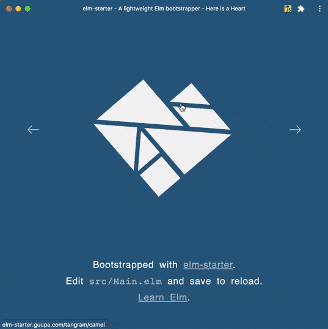
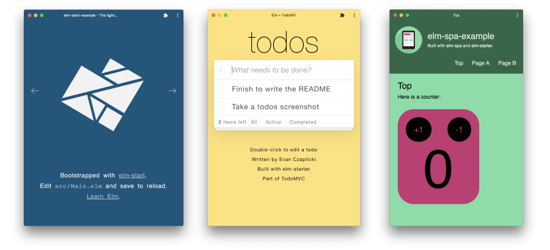
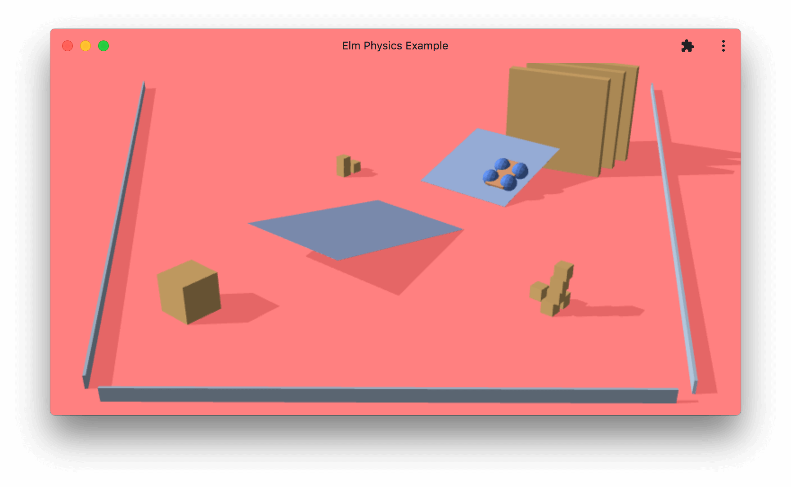
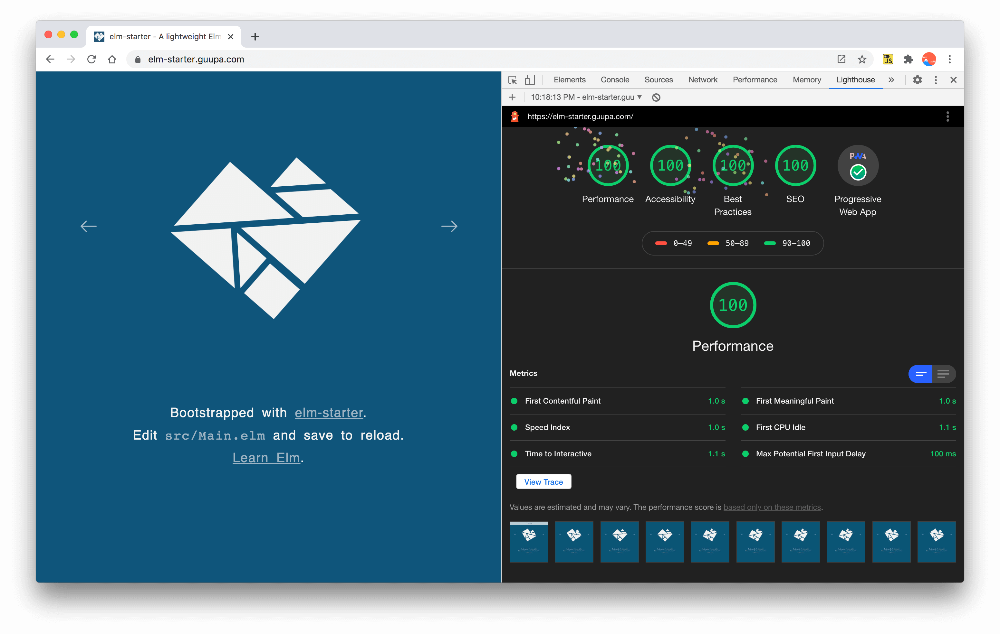
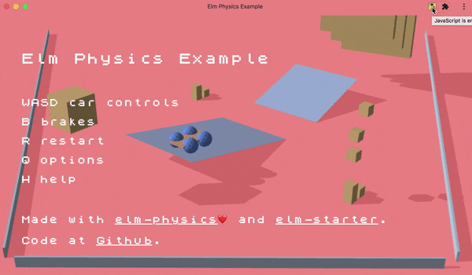
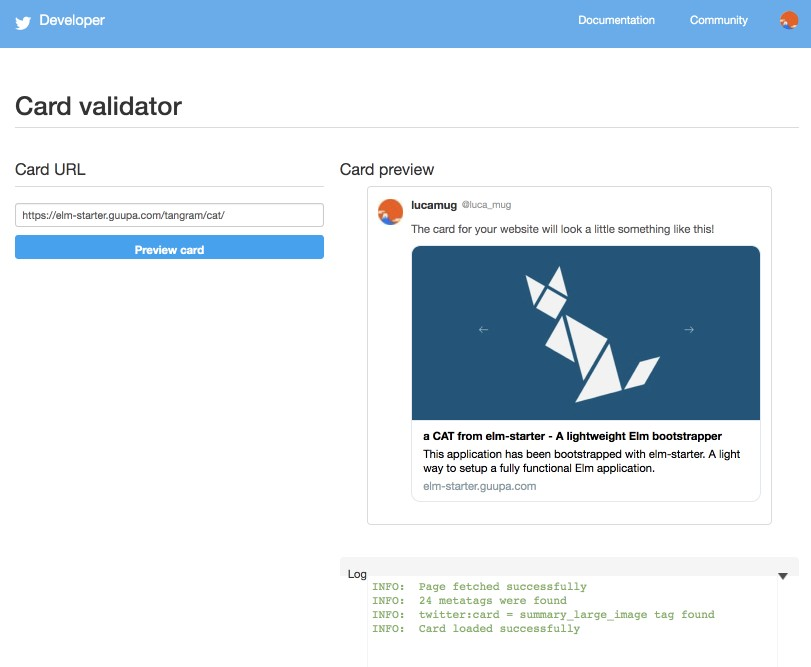

# elm-starter

`elm-starter` is an experimental Elm-based Elm bootstrapper that can also be plugged into already existing Elm applications.

Post ["elm-starter", a tool for the Modern Web](https://dev.to/lucamug/elm-starter-a-tool-for-the-modern-web-53b1).

Example of the installed version, with and without Javascript enabled:



## Demos

These are three simple examples of websites built with `elm-starter`:

* [https://elm-starter.guupa.com/](https://elm-starter.guupa.com/) ([Code](https://github.com/lucamug/elm-starter))
* [https://elm-todomvc.guupa.com/](https://elm-todomvc.guupa.com/) ([Code](https://github.com/lucamug/elm-todomvc))
* [https://elm-spa-example.guupa.com/](https://elm-spa-example.guupa.com/) ([Code](https://github.com/lucamug/elm-spa-example))
* [https://elm-physics-example.guupa.com/](https://elm-physics-example.guupa.com/) ([Code](https://github.com/lucamug/elm-physics-example))




## Characteristics

* Generate a PWA (Progressive Web Application)
* Mostly written in Elm
* Pages are pre-rendered at build time
* Works offline
* Works without Javascript(\*)
* SEO
* Preview cards (Facebook, Twitter, etc.) work as expected
* Installable both on desktop and on mobile
* High score with Lighthouse
* Friendly notifications: "Loading...", "Must enable Javascript...", "Better enable Javascript..."
* Potentially compatible with all Elm libraries (elm-ui, elm-spa, etc.)
* Hopefully relatively simple to use and maintain
* Non invasive (you can easily add/remove it)
* Works with Netlify, Surge, etc.

Lighthouse report:



Slack's previews (note how different urls have different snapshot and meta-data):


## How to bootstrap a new project

`elm-starter` is not published in npm yet and it doesn't have a specific command to bootstrap a project, so the way it works now is cloning this repo.

The fastest way is to [click here](https://app.netlify.com/start/deploy?repository=https://github.com/lucamug/elm-starter). This will automatically clone the repo and publish in Netlify.

[](https://app.netlify.com/start/deploy?repository=https://github.com/lucamug/elm-starter)

Otherwise the steps are:

```sh
git clone https://github.com/lucamug/elm-starter
mv elm-starter my-new-project
cd my-new-project
rm -rf .git
npm install
```

Done! `elm-starter` is installed.

To start using it you should create your own git repository, add files and make a commit (example: `git init && git add . && git commit -m "initial commit"`).

These are the available commands:

### `$ npm start`

Runs the app in the development mode.
Open [http://localhost:8000](http://localhost:8000) to view it in the browser.

Edit `src/Main.elm` and save to reload the browser.

Also edit `src/Index.elm` and `package.json` for further customization.

### `$ npm run build`

Builds the app for production to the `elm-stuff/elm-starter-files/build` folder.

### `$ npm run serverBuild`

Launches a server in the `build` folder.

Open [http://localhost:9000](http://localhost:9000) to view it in the browser.

## How to use `elm-starter` in existing Elm application

Let's suppose your existing project is in `my-elm-app`

* Clone `elm-starter` with  
    `$ git clone https://github.com/lucamug/elm-starter.git`
* Copy the folder [`elm-starter/src-elm-starter/`](https://github.com/lucamug/elm-starter/tree/master/src-elm-starter) to `my-elm-app/src-elm-starter/`
* Copy the file [`elm-starter/src/Index.elm`](https://github.com/lucamug/elm-starter/blob/master/src/Index.elm) to `my-elm-app/src/Index.elm`
* Copy the function `conf` from [`elm-starter/src/Main.elm`](https://github.com/lucamug/elm-starter/blob/master/src/Main.elm#L33) to `my-elm-app/src/Main.elm` (remember also to expose it)
* If you don't have `package.json` in your project, add one with `$ npm init`
* Be sure that you have these values in `package.json` as they will be used all over the places:

  * "name" - An npm-compatible name (cannot contain spaces)
  * "nameLong" - The regular name used all over the places, like in the `<title>` of the page, for example
  * "description"
  * "author"
  * "twitterSite" - A reference to a Twitter handle (Just the id without "@")
  * "twitterCreator" - Another Twitter handle, refer to [Twitter cards markups]([https://developer.twitter.com/en/docs/](https://developer.twitter.com/en/docs/)  tweets/optimize-with-cards/overview/markup)
  * "version"
  * "homepage"
  * "license"
  * "snapshotWidth" - default: 700 px
  * "snapshotHeight" - default: 350 px
  * "themeColor" - default: { "red": 15, "green": 85, "blue": 123 }

* Add `node` dependencies with these commands

    ```sh
    npm install --save-dev chokidar-cli
    npm install --save-dev concurrently
    npm install --save-dev elm
    npm install --save-dev elm-live
    npm install --save-dev html-minifier
    npm install --save-dev puppeteer
    npm install --save-dev terser
    ```

* Add `src-elm-starter` as an extra `source-directory` in `elm.json`, the same as in `elm-starter/elm.json`
* Add these commands to `package.json` (or run them directly)

    ```json
      "scripts": {
        "start":       "node ./src-elm-starter/starter.js start",
        "build":       "node ./src-elm-starter/starter.js build",
        "serverBuild": "node ./src-elm-starter/starter.js serverBuild"
      },
    ```

Done!

## `sandbox` vs. `element` vs. `document` vs. `application`

In Elm there are several ways to start an application:

* [Browser.sandbox](https://package.elm-lang.org/packages/elm/browser/latest/Browser#sandbox)
* [Browser.element](https://package.elm-lang.org/packages/elm/browser/latest/Browser#element)
* [Browser.document](https://package.elm-lang.org/packages/elm/browser/latest/Browser#document)
* [Browser.application](https://package.elm-lang.org/packages/elm/browser/latest/Browser#application)

Among these, the first two take over only one specific node of the DOM, the other two instead take over the entire body of the page. So we need to follow two different strategies.

### Case for `sandbox` & `element`

In the `Index.elm` you need to create a `<div>` that will be used to attach the Elm application.

In the `elm-starter` example we use a `<div>` with id `elm`. In `Index.elm`, see the line:

```
    ++ [ div [ id "elm" ] [] ]
```

Then we use this node to initialize Elm:

```
var node = document.getElementById('elm');
window.ElmApp = Elm.Main.init(
    { node: node
    , flags: ...you flags here...
    }
```

Then, to be sure that the node created by the static page generator is replaced later on, we need to add such `<div>` in the  `view` of `Main.elm` like this:

```
view : Model -> Html.Html Msg
view model =
    Html.div
        [ Html.Attributes.id "elm" ]
        [ ...you content here... ]
```

Note: You can change the id from `elm` to anything you like.

### Case for `document` & `application`

This case require a different approach. You can see an example in the [elm-spa-example](https://github.com/lucamug/elm-spa-example).

The main differences compared to the above approach are:

* You **don't** need to create a specific `<div>` with id `elm`.
* You need to move all Javascript section of the page into the `htmlToReinject` section (see [Index.elm](https://github.com/lucamug/elm-spa-example/blob/master/src/Index.elm) as example).

`htmlToReinject` will be injected after the page is generated during the build process assuring that the system will work also in this case.

## Netlify

When setting up the app with Netlify, input these in the deploy configuration:

* Build command: `npm run build` (or `node ./src-elm-starter/starter.js start`)
* Publish directory: `elm-stuff/elm-starter-files/build`

## (\*) Applications working without Javascript

Working without Javascript depends on the application. The `elm-starter` example works completely fine also without Javascript, the only missing thing is the smooth transition between pages.

The `elm-todomvc` example requires Javascript. Note that in this example, compared to Evan's original TodoMVC, I slightly changed the CSS to improve the a11y (mainly lack of contrast and fonts too small).

The `elm-spa-example` partially works without Javascript. You can browse across pages but the counters are not working.

`elm-starter` and `elm-todomvc` use `Browser.element`, while `elm-spa-example` use `Browser.application`.

The setup for these two cases is a bit different. `Browser.application` requires to use `htmlToReinject` (see `Index.elm`) because Elm is wiping out all the content in the body. Also the node where Elm attach itself needs to be removed (see `node.remove()` ).

The working folder of `elm-starter` is `elm-stuff/elm-starter-files`. These files are automatically generated and should not be edited directly, unless during some debugging process.

## Advanced stuff

## File generation

* Most of the logic is written in Elm, including the code to generate all necessary files:
  * `index.html` (generated from [`Index.elm`](https://github.com/lucamug/elm-start-private/blob/master/src/Index.elm) using [`zwilias/elm-html-string`](https://package.elm-lang.org/packages/zwilias/elm-html-string/latest/))
  * [`sitemap.txt`](https://elm-starter.guupa.com/sitemap.txt)
  * [`manifest.json`](https://elm-starter.guupa.com/manifest.json)
  * [`service-worker.js`](https://elm-starter.guupa.com/service-worker.js)
  * [`robots.txt`](https://elm-starter.guupa.com/robots.txt)

## Disabling pre-rendering

Is possible to disable pre-rendering just passing an empty list to `Main.conf.urls`. In this case the app will work as "Full CSR" (Full Client-side Rendering)

This is an example of application with pre-rendering disabled. In this case also the WebGL animation caused some time out issue with puppeteer and it would not be necessary anyway to have this application render without Javascript as it based entirely on Javascript.

Not the message when Javascript is disabled:




## How to customize your project

The main two places where you can change stuff are:

* `src/Index.elm`
* `src/Main.elm` (`conf` function)

`elm-starter` is opinionated about many things. If you want more freedom, you can change stuff in

* `src-elm-starter/**/*.elm`

The reason `Main.conf` is inside `Main.elm` is so that it can exchange data. For example:

* `title`: `Main.conf` -> `Main`
* `urls`: `Main.conf` <- `Main`

Moreover `Main.conf` is used by `src-elm-starter` to generate all the static files.

## elm-console-debug.js for nice console output

Support [https://github.com/kraklin/elm-debug-transformer](https://github.com/kraklin/elm-debug-transformer) out of the box for nice `Debug.log` messages in the console.

## Changing meta-tags

For better SEO, you should update meta-tags using the predefined port `changeMeta` that you can use this way:

```elm
Cmd.batch
    [ changeMeta { querySelector = "title", fieldName = "innerHTML", content = title }
    , changeMeta { querySelector = "meta[property='og:title']", fieldName = "content", content = title }
    , changeMeta { querySelector = "meta[name='twitter:title']", fieldName = "value", content = title }
    , changeMeta { querySelector = "meta[property='og:image']", fieldName = "content", content = image }
    , changeMeta { querySelector = "meta[name='twitter:image']", fieldName = "content", content = image }
    , changeMeta { querySelector = "meta[property='og:url']", fieldName = "content", content = url }
    , changeMeta { querySelector = "meta[name='twitter:url']", fieldName = "value", content = url }
    ]
```

You can validate Twitter preview cards at [https://cards-dev.twitter.com/validator](https://cards-dev.twitter.com/validator)



## Configuration

You can verify the configuration in real-time using elm reactor:

```sh
node_modules/.bin/elm reactor
```

and check the page

[http://localhost:8000/src-elm-starter/Application.elm](http://localhost:8000/src-elm-starter/Application.elm)

## Globally available objects

There are three global objects available

### `ElmStarter`

`ElmStarter` contain metadata about the app:

```javascript
{ commit: "abf04f3"   // coming from git
, branch: "master"    // coming from git
, env: "dev"          // can be "dev" or "prod"
, version: "0.0.5"    // coming from package.json
}
```

This data is also available in Elm through Flags.

### `ElmApp`

`ElmApp` is another global object that contains the handle of the Elm app.

### `Elm`

This is the object exposed by the compiler used to initialize the application.

## Limitations

* Javascript and CSS to generate the initial `index.html` are actually strings :-(
* `src-elm-starter/starter.js`, the core of `elm-starter`, is ~330 lines of Javascript. I wish it could be smaller
* If your Elm code relies on data only available at runtime, such as window size or dark mode, prerendering is probably not the right approach. In this case you may consider [disabling pre-rendering](#disabling-pre-rendering) and use other alternatives, such as [Netlify prerendering](https://docs.netlify.com/site-deploys/post-processing/prerendering/#set-up-prerendering)

Note

* The smooth rotational transition in the demo only works in Chrome. I realized it too late, but you get the picture

## Non-goals

Things that `elm-starter` is not expected to do

* Doesn't generate Elm code automatically, like Route-parser, for example
* Doesn't touch/wrap the code of your Elm Application
* Doesn't do live SSR (Server Side Render) but just pre-render during the build
* Doesn't change the Javascript coming out from the Elm compiler
* Doesn't create a web site based on static files containing Markdown
* There is no "[hydration](https://developers.google.com/web/updates/2019/02/rendering-on-the-web)", unless Elm does some magic that I am not aware of.

You can find several of these characteristics in some of the [similar projects](#similar-projects).

Using as reference the table at the bottom of the article [Rendering on the Web](https://developers.google.com/web/updates/2019/02/rendering-on-the-web), `elm-starter` can support you in these rendering approach

* Static SSR
* CSR with Prerendering
* Full CSR

It cannot help you with

* Server Rendering
* SSR with (re)hydration

## Similar projects

These are other projects that can be used to bootstrap an Elm application or to generate a static site:

* [elm-pages](https://package.elm-lang.org/packages/dillonkearns/elm-pages/latest/)
* [elmstatic](https://github.com/alexkorban/elmstatic)
* [elm-spa](https://package.elm-lang.org/packages/ryannhg/elm-spa/latest/)
* [create-elm-app](https://github.com/halfzebra/create-elm-app)
* [spades](https://github.com/rogeriochaves/spades)

Here are similar projects for other Languages/Frameworks:

* [staticgen.com](https://www.staticgen.com/)
